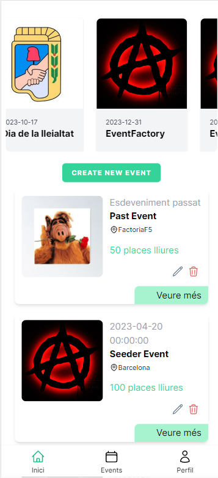
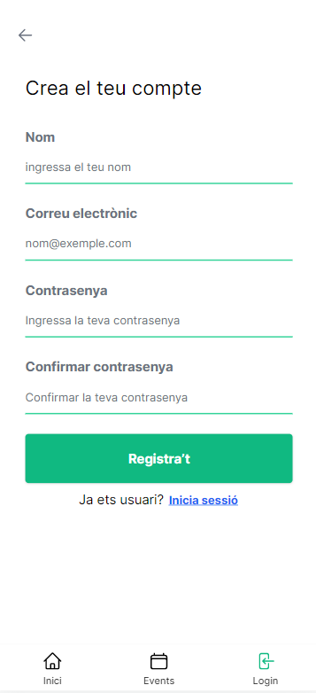
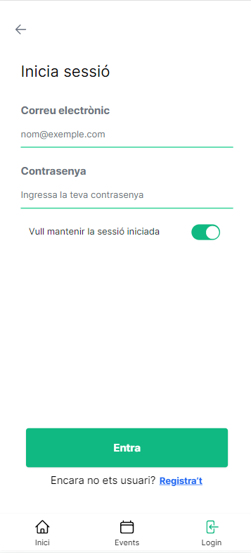
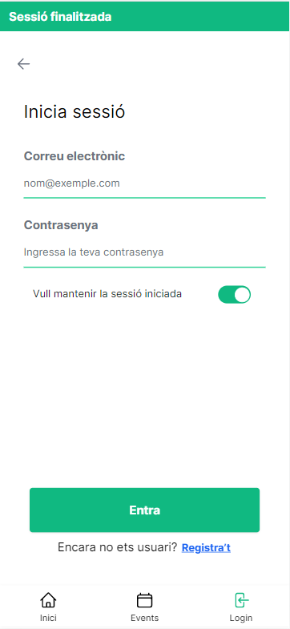
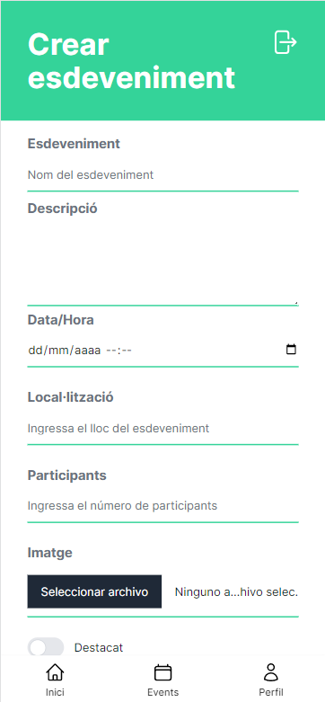
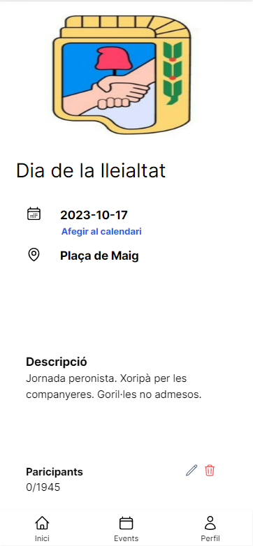
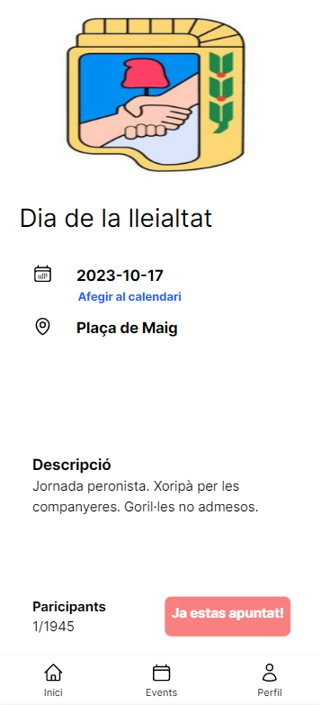

# Tech Events Manager

## Table of Contents
- [Tech Events Manager](#tech-events-manager)
  - [Table of Contents](#table-of-contents)
  - [General Information](#general-information)
  - [Screenshots](#screenshots)
  - [Technologies](#technologies)
  - [Installation](#installation)
  - [Versions](#versions)
  - [Deployment](#deployment)
  - [Support](#support)
  - [Collaboration](#collaboration)
  - [Authors](#authors)
  - [FAQs](#faqs)
***
## General Information
Tech Events Manager is a mobile app designed to manage Eventsaverno's online events, such as workshops, masterclasses and webinars.
Users may join and leave events, and access information related to them.

 

***

## Screenshots

<table>
<tr>
<td></td>
<td></td>
<td></td>
<td></td>
</tr>
<tr>
<td></td>
<td></td>
<td></td>
<td></td>
</tr>
</table>

***

## Technologies
The project was developed with the following technologies

* PHP
* Laravel 9
* Blade
* Tailwind
* Flowbite
* Node Js
* Npm
* Vite

## Installation

1- Install PHP and Composer on your computer. You can find instructions for this on the [PHP website](https://www.php.net/).

2- Clone the app's repository from GitHub on this [link](https://github.com/adriansunye/tech-events-manager-server.git)

3 - Navigate to the app's directory: 
`cd tech-events-manager-server`

4 - Install the app's dependencies using Composer:  
`composer install`

5 - Create a new file named .env and enter your credentials 
`cp .env.example .env`

6 - Install the app's JavaScript dependencies using npm: 
`npm install`

7 - Compile the app's assets using npm: 
`npm run dev` and `npm run build`

8 - Create the database using a relational database 

9 - Run the migrations to create the tables and relationships, and populate the data with the seeders: 
´php artisan migrate:fresh --seed´

10 - Run the app using PHP: 
`php artisan serve`

## Versions

PHP 8.0.2 
laravel/framework: 9.19

* Plugins

spatie/laravel-permission 5.8 
intervention/image 2.7 
sempro/phpunit-pretty-print 1.4

***
## Deployment

  
[Visit our link](https://)

***

## Support

To handle any enquiries contact
>andres.patino@factoriaf5.org

***

## Collaboration
The project is open to user contributions. If you wish to contribute you should contact:

> andres.patino@factoriaf5.org
***
## Authors

[Adrián Suñe](https://https://github.com/adriansunye)  
[Lidia Luque Gallego](https://github.com/LidiaLG)   
[Ingrid Barrachina](https://github.com/IngridB-afk)  
[Erick Crespín](https://github.com/ecp12)  
[Mario Valdés](https://github.com/Mariovalcen)   
[federico gatti](https://github.com/fcegatti)

***
## FAQs

We'll fill this field when you ask something

